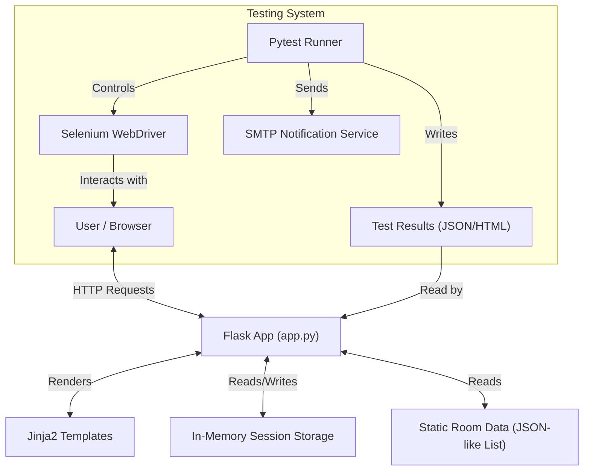

# 📘 AURA Hotel - Project Documentation

## 1. Overview
**AURA Hotel** is a modern, Flask-based hotel booking demonstration application designed for **Software Quality Assurance (SQA)** and **Test Automation** practice. It features a premium, Egyptian-themed UI with "glassmorphism" design aesthetics.

### Target Users
- **QA Engineers**: To practice writing automated tests (Selenium, Playwright, Cypress).
- **Developers**: To demonstrate modern Flask web development with server-side rendering.
- **Students**: To learn about booking systems, session management, and state handling.

### Main Features
- **Room Discovery**: Advanced search and filtering (by price, type, amenities).
- **Rich Room Details**: Modal views with comprehensive room specs (size, floor, bed type).
- **Booking Engine**: Complete flow from selection to confirmation (using session storage).
- **Admin Dashboard**: Real-time visualization of booking stats and automated test results.
- **Email Notifications**: Automated alerts for test run statuses.

---

## 2. Technology Stack

### Backend
- **Framework**: Flask 3.0.3 (Python 3.9+)
- **Session Management**: Client-side signed cookies (Flask default session)
- **Template Engine**: Jinja2

### Frontend
- **CSS Framework**: Bootstrap 5.3
- **Custom Styling**: Native CSS with Glassmorphism effects
- **Icons**: Bootstrap Icons
- **JavaScript**: Vanilla JS + Chart.js (for dashboard analytics)

### Testing & Tools
- **Test Runner**: Pytest
- **Browser Automation**: Selenium WebDriver
- **Reporting**: pytest-html
- **Environment Management**: python-dotenv

---

## 3. Architecture

The application follows a standard **Model-View-Template (MVT)** architecture pattern, typical for Flask applications.



### Module Responsibilities
- **`app.py`**: The core controller. Handles routing, business logic, session manipulation, and serves views.
- **`templates/`**: categorization of HTML views (Base, Home, Rooms, Booking, Dashboard).
- **`static/css/`**: UI styling using CSS variables for theming.
- **`tests/`**: Automated test suite and fixtures.

---

## 4. Folder Structure

```
hotel_test/
├── app.py                  # Main application entry point
├── requirements.txt        # Core dependencies
├── .env                    # Configuration (secrets)
├── static/
│   └── css/styles.css      # Global styles & design system
├── templates/
│   ├── base.html           # Master layout (navbar, footer)
│   ├── rooms.html          # Room listing & modals
│   └── dashboard.html      # Stats & test reports
├── tests/
│   ├── conftest.py         # Pytest fixtures & Selenium setup
│   └── test_*.py           # Test suites
└── test_results/           # Generated JSON/HTML reports
```

---

## 5. Setup & Installation

### Prerequisites
- Python 3.9 or higher
- Chrome Browser (for Selenium tests)
- Git

### Installation Steps

1. **Clone the Repository**
   ```bash
   git clone https://github.com/your-username/hotel_test.git
   cd hotel_test
   ```

2. **Create Virtual Environment**
   ```bash
   python -m venv venv
   # Windows
   venv\Scripts\activate
   # macOS/Linux
   source venv/bin/activate
   ```

3. **Install Dependencies**
   ```bash
   pip install -r requirements.txt
   # Install testing extras (if not in requirements.txt)
   pip install pytest selenium webdriver-manager python-dotenv pytest-html
   ```

4. **Configuration**
   Copy `.env.example` to `.env` and configure your settings.
   ```bash
   cp .env.example .env
   ```

5. **Run the Application**
   ```bash
   python app.py
   ```
   Access at `http://127.0.0.1:5000`

---

## 6. Configuration (.env)

| Variable | Required | Default | Description | Example |
|----------|:--------:|:-------:|-------------|---------|
| `NOTIFY_EMAIL_TO` | No | - | Recipient for test reports | `admin@company.com` |
| `NOTIFY_EMAIL_FROM` | No | - | Sender Gmail address | `bot@gmail.com` |
| `NOTIFY_EMAIL_PASSWORD` | No | - | Gmail App Password | `abcd 1234 efgh 5678` |
| `HEADLESS` | No | `1` | browser visibility (0=show, 1=hide) | `0` |

---

## 7. Data Flow & State Management

**State is non-persistent**. The application does not use a database (SQL/NoSQL).
- **Rooms**: Stored as a constant `ROOMS` list in `app.py`. Read-only.
- **Users**: Single static admin user (`admin`/`1234`).
- **Reservations**: Stored in the Flask `session` object (client-side cookie). 
  - *Implication*: If you clear your browser cookies or restart the browser (without session persistence config), bookings are lost.
  - *Testing Implication*: Tests must verify state within a single session context.

---

## 8. UI Components

- **Room Card**: Displays image, title, price, and "Book"/"Details" buttons.
- **Detail Modal**: Glassmorphic overlay showing rating stars, amenities badges, and extended description.
- **Toast Notifications**: Used for success/error messages (e.g., "Login Successful", "Room not found").
- **Dashboard Widgets**: Cards displaying total bookings, revenue (simulated), and pass/fail test metrics.

---

## 9. Logging & Error Handling

- **Logging**: Currently minimal. Relies on Flask's default stdout logging.
- **Error Handling**: 
  - `flash()` messages are used to inform users of errors (e.g., "Invalid date", "Wrong password").
  - 404/500 errors use default Flask error pages (opportunity for improvement).

---

## 10. Deployment

Since the app is stateless (except for sessions), it is easy to deploy using any WSGI container.

**Production Config recommendations**:
1. Use `gunicorn` instead of `python app.py`.
   ```bash
   gunicorn -w 4 -b 0.0.0.0:5000 app:app
   ```
2. Set a secure `SECRET_KEY` env var for session signing.
3. Disable `debug=True` in `app.run()`.

---

## 11. Troubleshooting

| Issue | Cause | Fix |
|-------|-------|-----|
| **"Driver not found"** | Missing Chrome or webdriver | Run `pip install webdriver-manager` and ensure Chrome is installed. |
| **Email fails to send** | MFA enabled on Gmail | Use an **App Password**, not your login password. |
| **Login fails loop** | Browser blocking cookies | Enable cookies for localhost. |
| **Tests fail in CI** | Headless mode off | Set `HEADLESS=1` in CI environment. |

---

## 12. License & Credits

**License**: MIT License. Free for educational use.

**Credits**:
- Images by [Unsplash](https://unsplash.com)
- Icons by [Bootstrap Icons](https://icons.getbootstrap.com)
- Developed for SQA & Automation Coursework.
